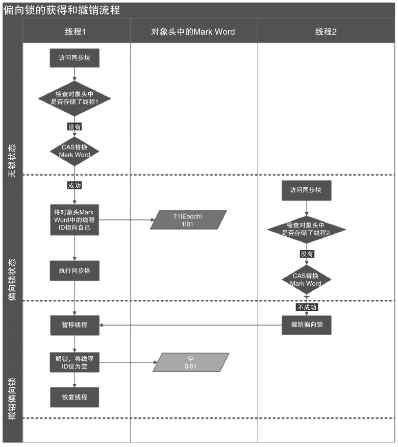
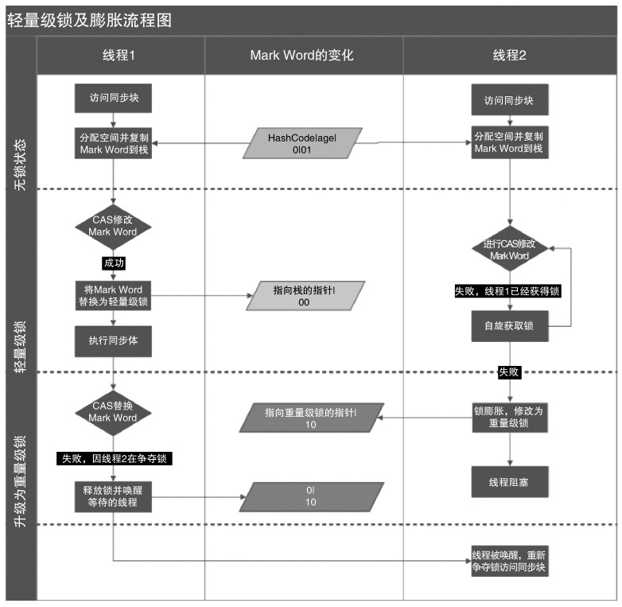
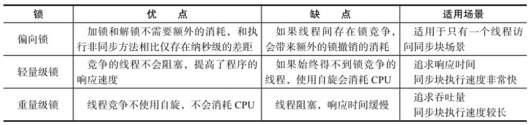
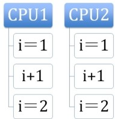

## 第二章 Java 并发机制的底层实现原理
Java 代码在编译后会变成 Java 字节码，字节码被类加载器加载到 JV M里，JVM 执行字节码，最终需要转化为汇编指令在 CPU 上执行，
Java 中所使用的并发机制依赖于 JVM 的实现和 CPU 的指令。
### volatile 的应用
volatile 是轻量级的 synchronized，它保证了共享变量的“可见性”。可见性的意思是当一个线程修改一个共享变量时，另外一个线程能读到这个修改的值。
如果 volatile 变量修饰符使用恰当的话，它比 synchronized 的使用和执行成本更低，因为它不会引起线程上下文的切换和调度。
#### volatile 的定义与实现原理
Java 语言规范第 3 版中对 volatile 的定义如下：Java 编程语言允许线程访问共享变量，为了确保共享变量能被准确和一致地更新，线程应该确保通过排他锁单独获得这个变量。
如果一个字段被声明成 volatile，Java 线程内存模型确保所有线程看到这个变量的值是一致的。
在了解 volatile 实现原理之前，我们先来看下与其实现原理相关的 CPU 术语与说明。下表是 CPU 术语的定义。
<table>
    <thead>
        <tr>
            <th>术语</th>
            <th>英文单词</th>
            <th>术语描述</th>
        </tr>
    </thead>
    <tbody>
        <tr>
            <td>内存屏障</td>
            <td>memory barriers</td>
            <td>是一组处理器指令，用于实现对内存操作的顺序限制。</td>
        </tr>
        <tr>
            <td>缓冲行</td>
            <td>cache line</td>
            <td>缓存可以分配的最小存储单位。处理器填写缓存线时会加载整个缓存线，需要使用多个主内存读周期</td>
        </tr>   
        <tr>
            <td>原子操作</td>
            <td>atomic operations</td>
            <td>不可中断的一个或一系列操作。</td>
        </tr>
        <tr>
            <td>缓存行填充</td>
            <td>cache line fill</td>
            <td>当处理器识别到从内存中读取操作数是可缓存的，处理器读取整个缓存行到适当的缓存（L1、L2、L3 或所有）。</td>
        </tr>
        <tr>
            <td>缓存命中</td>
            <td>cache hit</td>
            <td>如果进行高速缓存行填充操作的位置仍然是下次处理器访问的地址时，处理器从缓存中读取操作数而不是内存中读取。</td>
        </tr>
        <tr>
            <td>写命中</td>
            <td>write hit</td>
            <td>当处理器将一个操作数写回到一个内存缓存的区域时，它首先会检查这个缓存的内存地址是否在缓存行中，如果存在一个有效的缓存行，
            则处理器将这个操作数写回到缓存，而不是写回到内存，这个操作被称作写命中。</td>
        </tr>
        <tr>
            <td>写缺失</td>
            <td>write misses the cache</td>
            <td>一个有效的缓存行被写入到不存在的内存区域。</td>
        </tr>                                                   
    </tbody>
</table>
volatile 是如何来保证可见性的呢？让我们在 X86 处理器下通过工具获取 JIT 编译器生成的汇编指令来查看对 volatile 进行写操作时，CPU 会做什么事情。

``volatile Singleton instance = new Singleton()``

转变成汇编代码，如下。

``0x01a3de1d: movb $0×0,0×1104800(%esi);0x01a3de24: lock addl $0×0,(%esp);``

通过查 IA-32 架构软件开发者手册可知，Lock 前缀的指令在多核处理器下会引发了两件事。

1. 将当前处理器缓存行的数据写回到系统内存。
2. 这个写回内存的操作会使在其他CPU里缓存了该内存地址的数据无效。

为了提高处理速度，处理器不直接和内存进行通信，而是先将系统内存的数据读到内部缓存（L1，L2 或其他）后再进行操作，但操作完不知道何时会写到内存。
如果对声明了 volatile 的变量进行写操作，JVM 就会向处理器发送一条 Lock 前缀的指令，将这个变量所在缓存行的数据写回到系统内存。但是就算写回到内存，
如果其他处理器缓存的值还是旧的，再执行计算操作就会有问题。所以在多处理器下，为了保证各个处理器的缓存是一致的，就会实现缓存一致性协议，
每个处理器通过嗅探在总线上传播的数据来检查自己缓存的值是不是过期了，当处理器发现自己缓存行对应的内存地址被修改，就会将当前处理器的缓存行设置成无效状态，
当处理器对这个数据进行修改操作的时候，会重新从系统内存中把数据读到处理器缓存里。

#### synchronized 的实现原理与应用
利用 synchronized 实现同步的基础：Java 中的每一个对象都可以作为锁。具体表现为以下 3 种形式。
- 对于普通同步方法，锁是当前实例对象。
- 对于静态同步方法，锁是当前类的 Class 对象。
- 对于同步方法块，锁是 Synchonized 括号里配置的对象。
当一个线程试图访问同步代码块时，它首先必须得到锁，退出或抛出异常时必须释放锁。那么锁到底存在哪里呢？锁里面会存储什么信息呢？

从 JVM 规范中可以看到 Synchonized 在 JVM 里的实现原理，JVM 基于进入和退出 Monitor 对象来实现方法同步和代码块同步，但两者的实现细节不一样。
代码块同步是使用 monitorenter 和 monitorexit 指令实现的，而方法同步是使用另外一种方式实现的，细节在 JVM 规范里并没有详细说明。但是，
方法的同步同样可以使用这两个指令来实现。monitorenter 指令是在编译后插入到同步代码块的开始位置，而 monitorexit 是插入到方法结束处和异常处，
JVM 要保证每个 monitorenter 必须有对应的 monitorexit 与之配对。任何对象都有一个 monitor 与之关联，当且一个 monitor 被持有后，
它将处于锁定状态。线程执行到 monitorenter 指令时，将会尝试获取对象所对应的 monitor 的所有权，即尝试获得对象的锁。

##### Java 对象头
synchronized 用的锁是存在 Java 对象头里的。如果对象是数组类型，则虚拟机用 3 个字宽（Word）存储对象头，如果对象是非数组类型，
则用 2 字宽存储对象头。在 32 位虚拟机中，1 字宽等于 4 字节，即 32bit，如下表所示。
<table>
    <thead>
        <tr>
            <th>长度</th>
            <th>内容</th>
            <th>说明</th>
        </tr>
    </thead>
    <tbody>
        <tr>
            <td>32/64bit</td>
            <td>Mark Word</td>
            <td>存储对象的 hashCode 或锁信息等</td>
        </tr>
        <tr>
            <td>32/64bit</td>
            <td>Class Metadata address</td>
            <td>存储到对象类型数据的指针</td>
        </tr>
        <tr>
            <td>32/32bit</td>
            <td>Array Length</td>
            <td>存储数组的长度（如果当前对象是数组）</td>
        </tr>
    </tbody>
</table>
Java 对象头里的 Mark Word 里默认存储对象的 hashCode、分代年龄和锁标记位。32 位 JVM 的 Mark Word 的默认存储结构如下表所示。
<table>
    <thead>
        <tr>
            <th>锁状态</th>
            <th>25bit</th>
            <th>4bit</th>
            <th>1bit 是否是偏向锁</th>
            <th>2bit 锁标志位</th>
        </tr>
    </thead>
    <tbody>
        <tr>
            <td>无锁状态</td>
            <td>对象的 hashCode</td>
            <td>对象的 分代年龄</td>
            <td>0</td>
            <td>01</td>
        </tr>
    </tbody>
</table>
在运行期间，Mark Word 里存储的数据会随着锁标志位的变化而变化。MarkWord 可能变化为存储以下 4 种数据，如下表所示。

在 64 位虚拟机下，Mark Word 是 64bit 大小的，其存储结构如下表所示。

##### 锁的升级与对比
Java SE 1.6 为了减少获得锁和释放锁带来的性能消耗，引入了偏向锁和轻量级锁，在 Java SE 1.6 以后，锁一共有 4 种状态，
级别从低到高依次是：无锁状态、偏向锁状态、轻量级锁状态和重量级锁状态，这几个状态会随着竞争情况逐渐升级。锁可以升级但不能降级，
意味着偏向锁升级成轻量级锁后不能降级成偏向锁。这种锁升级却不能降级的策略，目的是为了提高获得锁和释放锁的效率。

###### 偏向锁
HotSpot 的作者发现大多数情况下，锁不仅不存在多线程竞争，而且总是由同一线程多次获得，为了让线程获得锁的代价更低而引入了偏向锁。
当一个线程访问同步块并获取锁时，会在对象头和栈帧中的锁记录里存储锁偏向的线程 ID，以后该线程在进入和退出同步块时不需要进行 CAS 操作来加锁和解锁，
只需简单地测试一下对象头的 Mark Word 里是否存储着指向当前线程的偏向锁。如果测试成功，表示线程已经获得了锁。如果测试失败，
则需要再测试一下 Mark Word 中偏向锁的标识是否设置成 1（表示当前是偏向锁）：如果没有设置，则使用 CAS 竞争锁；如果设置了，则尝试使用 CAS 将对象头的偏向锁指向当前线程。

> 偏向锁的撤销

偏向锁使用了一种等到竞争出现才释放锁的机制，所以当其他线程尝试竞争偏向锁时，持有偏向锁的线程才会释放锁。偏向锁的撤销，需要等待全局安全点（在这个时间点上没有正在执行的字节码）。
它会首先暂停拥有偏向锁的线程，然后检查持有偏向锁的线程是否活着，如果线程不处于活动状态，则将对象头设置成无锁状态；如果线程仍然活着，拥有偏向锁的栈会被执行，遍历偏向对象的锁记录，
栈中的锁记录和对象头的 Mark Word 要么重新偏向于其他线程，要么恢复到无锁或者标记对象不适合作为偏向锁，最后唤醒暂停的线程。

下图中的线程 1 演示了偏向锁初始化的流程，线程 2 演示了偏向锁撤销的流程。

> 关闭偏向锁

偏向锁在 Java 6 和 Java 7 里是默认启用的，但是它在应用程序启动几秒钟之后才激活，如有必要可以使用 JVM 参数来关闭延迟：-XX:BiasedLockingStartupDelay=0。
如果你确定应用程序里所有的锁通常情况下处于竞争状态，可以通过 JVM 参数关闭偏向锁：-XX:-UseBiasedLocking=false，那么程序默认会进入轻量级锁状态。

###### 轻量级锁
> 轻量级锁加锁

线程在执行同步块之前，JVM 会先在当前线程的栈桢中创建用于存储锁记录的空间，并将对象头中的 Mark Word 复制到锁记录中，官方称为 Displaced MarkWord。
然后线程尝试使用 CAS 将对象头中的 Mark Word 替换为指向锁记录的指针。如果成功，当前线程获得锁，如果失败，表示其他线程竞争锁，当前线程便尝试使用自旋来获取锁。

> 轻量级锁解锁

轻量级解锁时，会使用原子的 CAS 操作将 Displaced Mark Word 替换回到对象头，如果成功，则表示没有竞争发生。如果失败，表示当前锁存在竞争，锁就会膨胀成重量级锁。

下图是两个线程同时争夺锁，导致锁膨胀的流程图。

因为自旋会消耗 CPU，为了避免无用的自旋，一旦锁升级成重量级锁，就不会再恢复到轻量级锁状态。当锁处于这个状态下，其他线程试图获取锁时，都会被阻塞住，当持有锁的线程释放锁之后会唤醒这些线程，被唤醒的线程就会进行新一轮的夺锁之争。

##### 锁的优缺点

### 原子操作的实现
原理原子（atomic）本意是“不能被进一步分割的最小粒子”，而原子操作（atomic operation）意为“不可被中断的一个或一系列操作”。在多处理器上实现原子操作就变得有点复杂。在 Intel 处理器和 Java 里是如何实现原子操作的？

#### 术语定义
在了解原子操作的实现原理前，先要了解一下相关的术语。

##### 使用总线锁保证原子性
如果多个处理器同时对共享变量进行读改写操作（i++ 就是经典的读改写操作），那么共享变量就会被多个处理器同时进行操作，这样读改写操作就不是原子的，操作完之后共享变量的值会和期望的不一致。
举个例子，如果 i=1，我们进行两次 i++ 操作，我们期望的结果是 3，但是有可能结果是 2。原因可能是多个处理器同时从各自的缓存中读取变量 i，分别进行加 1 操作，然后分别写入系统内存中。
那么，想要保证读改写共享变量的操作是原子的，就必须保证 CPU1 读改写共享变量的时候，CPU2 不能操作缓存了该共享变量内存地址的缓存。

处理器使用总线锁就是来解决这个问题的。所谓总线锁就是使用处理器提供的一个 LOCK # 信号，当一个处理器在总线上输出此信号时，其他处理器的请求将被阻塞住，那么该处理器可以独占共享内存。

##### 使用缓存锁保证原子性
在同一时刻，我们只需保证对某个内存地址的操作是原子性即可，但总线锁定把 CPU 和内存之间的通信锁住了，这使得锁定期间，其他处理器不能操作其他内存地址的数据，所以总线锁定的开销比较大，
目前处理器在某些场合下使用缓存锁定代替总线锁定来进行优化。频繁使用的内存会缓存在处理器的 L1、L2 和 L3 高速缓存里，那么原子操作就可以直接在处理器内部缓存中进行，并不需要声明总线锁，
在目前的处理器中可以使用“缓存锁定”的方式来实现复杂的原子性。所谓“缓存锁定”是指内存区域如果被缓存在处理器的缓存行中，并且在 Lock 操作期间被锁定，那么当它执行锁操作回写到内存时，
处理器不在总线上声言 LOCK # 信号，而是修改内部的内存地址，并允许它的缓存一致性机制来保证操作的原子性，因为缓存一致性机制会阻止同时修改由两个以上处理器缓存的内存区域数据，
当其他处理器回写已被锁定的缓存行的数据时，会使缓存行无效，在下图所示的例子中，当 CPU1 修改缓存行中的 i 时使用了缓存锁定，那么 CPU2 就不能同时缓存 i 的缓存行。

**但是有两种情况下处理器不会使用缓存锁定。**

第一种情况是：当操作的数据不能被缓存在处理器内部，或操作的数据跨多个缓存行（cache line）时，则处理器会调用总线锁定。
第二种情况是：有些处理器不支持缓存锁定。对于 Intel 486 和 Pentium 处理器，就算锁定的内存区域在处理器的缓存行中也会调用总线锁定。

针对以上两个机制，我们通过 Intel 处理器提供了很多 Lock 前缀的指令来实现。例如，位测试和修改指令：BTS、BTR、BTC；交换指令 XADD、CMPXCHG，
以及其他一些操作数和逻辑指令（如 ADD、OR）等，被这些指令操作的内存区域就会加锁，导致其他处理器不能同时访问它。

### Java 如何实现原子操作
在 Java 中可以通过锁和循环 CAS 的方式来实现原子操作。

#### 使用循环 CAS 实现原子操作
JVM 中的 CAS 操作正是利用了处理器提供的 CMPXCHG 指令实现的。自旋 CAS 实现的基本思路就是循环进行 CAS 操作直到成功为止。

从 Java 1.5 开始，JDK 的并发包里提供了一些类来支持原子操作，如 AtomicBoolean、AtomicInteger 和 AtomicLong。

CAS 虽然很高效地解决了原子操作，但是 CAS 仍然存在三大问题：ABA 问题、循环时间长开销大、只能保证一个共享变量的原子操作。
##### ABA 问题
因为 CAS 需要在操作值的时候，检查值有没有发生变化，如果没有发生变化则更新，但是如果一个值原来是 A，变成了 B，又变成了 A，那么使用 CAS 进行检查时会发现它的值没有发生变化，
但是实际上却变化了。ABA 问题的解决思路就是使用版本号。在变量前面追加上版本号，每次变量更新的时候把版本号加 1，那么 A→B→A 就会变成 1A→2B→3A。
从 Java 1.5 开始，JDK 的 Atomic 包里提供了一个类 AtomicStampedReference 来解决 ABA 问题。这个类的 compareAndSet 方法的作用是首先检查当前引用是否等于预期引用，
并且检查当前标志是否等于预期标志，如果全部相等，则以原子方式将该引用和该标志的值设置为给定的更新值。
##### 循环时间长开销大
自旋 CAS 如果长时间不成功，会给 CPU 带来非常大的执行开销。如果 JVM 能支持处理器提供的 pause 指令，那么效率会有一定的提升。
pause 指令有两个作用：第一，它可以延迟流水线执行指令（de-pipeline），使 CPU 不会消耗过多的执行资源，延迟的时间取决于具体实现的版本，
在一些处理器上延迟时间是零；第二，它可以避免在退出循环的时候因内存顺序冲突（MemoryOrder Violation）而引起 CPU 流水线被清空（CPU Pipeline Flush），
从而提高 CPU 的执行效率。
##### 只能保证一个共享变量的原子操作
当对一个共享变量执行操作时，我们可以使用循环 CAS 的方式来保证原子操作，但是对多个共享变量操作时，循环 CAS 就无法保证操作的原子性，
这个时候就可以用锁。还有一个取巧的办法，就是把多个共享变量合并成一个共享变量来操作。比如，有两个共享变量 i=2,j=a，合并一下 ij=2a，
然后用 CAS 来操作 ij。从 Java 1.5 开始，JDK 提供了 AtomicReference 类来保证引用对象之间的原子性，就可以把多个变量放在一个对象里来进行 CAS 操作。
#### 使用锁机制实现原子操作
锁机制保证了只有获得锁的线程才能够操作锁定的内存区域。JVM 内部实现了很多种锁机制，有偏向锁、轻量级锁和互斥锁。除了偏向锁，JVM 实现锁的方式都用了循环 CAS，
即当一个线程想进入同步块的时候使用循环 CAS 的方式来获取锁，当它退出同步块的时候使用循环 CAS 释放锁。